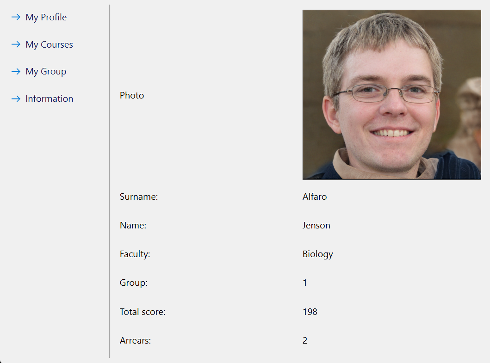

# Student Information System

## Table of Contents

- [Description](#description)
- [Screenshots](#screenshots)
- [Built With](#built-with)
- [Getting Started](#getting-started)
  - [Prerequisites](#prerequisites)
  - [Installation](#installation)
- [Usage](#usage)
- [License](#license)
- [Contacts](#contacts)

## Description

A kind of electronic diary for university students created using the Qt framework in which you can find out the schedule of subjects, see your personal information, see the group in which the student studies.

## Screenshots

## Built With

## Getting Started

You can register a new user by clicking on the Registration button or enter the data of an already created user, for example (login: jen1990, password: 53255eee2) You can also log in as an administrator and view a list of all students (login: 123, password: 123)

### Prerequisites

No additional installations are required

### Installation

Program is launched at startup University.exe which is located in the release folder

## Usage

The project is simple and intuitive. You can use it with your own database or use an existing one for educational purposes.

## License

For free! No license required

## Contacts

  
